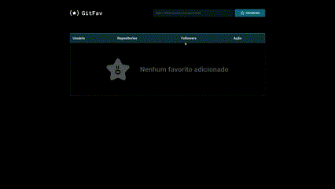

<h1 align="center" >Git Fav</h1>

<h3 align="center">Econtre perfis no Github, e os adiciones ao seus favoritos!</h3>
 

## Demonstração

    </img>

## Deploy

**Link para testes:** <a target="_blank" href="https://dev-joaovictor.github.io/Gitfav/">Gitfav.com</a>

## Stack utilizada

**Front-end:** HTML, CSS e JavaScript.

## Aprendizados
Neste projeto comecei a aprender novos conceitos em JavaScript, como : Assincronismo, Promises, Classes, Herança e API. 
